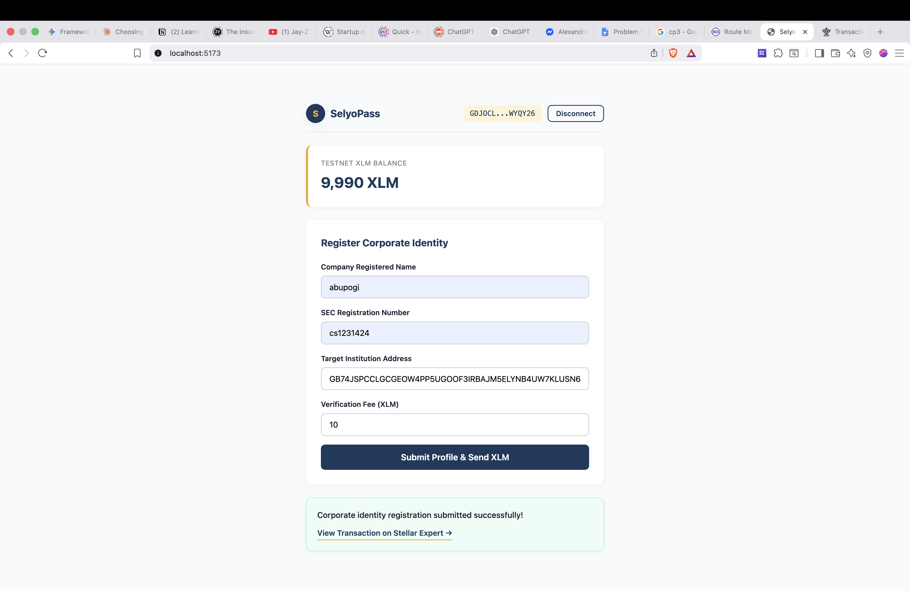
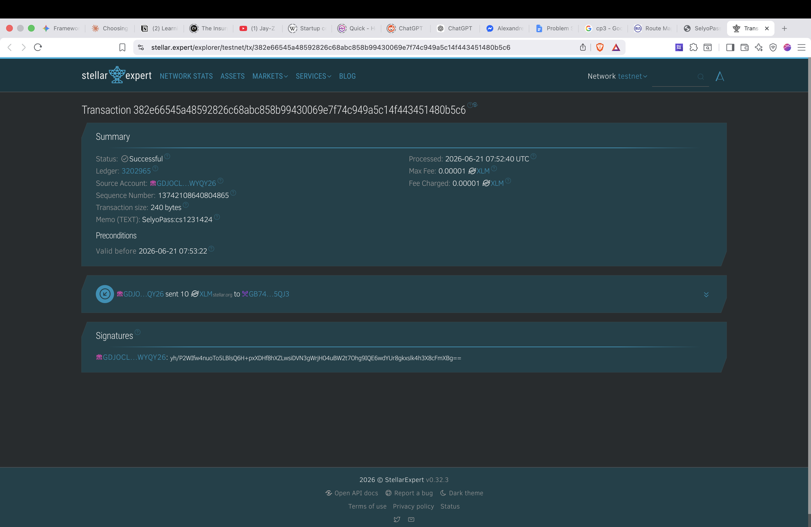

# SelyoPass

> **One verified mark. Open doors everywhere.**

## Overview

SelyoPass is a portable Know Your Business (KYB) credential platform built on the Stellar blockchain.

Early-stage Philippine startups face fragmented and repetitive KYB onboarding when integrating with banks, payment gateways, and other regulated financial institutions. Every institution requires nearly identical business documents — SEC registration, BIR certificate, Mayor's Permit, Articles of Incorporation, beneficial ownership disclosure — and each runs an independent intake cycle even though they are verifying the same legal entity. The result is weeks of compounded delay before each integration goes live.

SelyoPass lets a startup verify its corporate identity once with a regulated Stellar anchor (initially PDAX), and present that signed, structured credential to every future bank, payment partner, or marketplace. Institutions skip the document collection step and complete their compliance work faster while keeping full decision authority. SelyoPass eliminates document collection, not compliance judgment.

This repository is the Stellar Level 1 White Belt submission, which demonstrates the foundational on-chain mechanics. The full credential issuance and verification flow is on the roadmap toward Stellar Level 3 and the APAC Hackathon submission.

### Core Capabilities (Level 1 – White Belt)

- **Wallet Connection** – Connect and disconnect a Freighter wallet on Stellar Testnet
- **Balance Display** – Fetch and display the connected wallet's native XLM balance
- **Transaction Flow** – Build, sign, and submit an XLM payment transaction on testnet
- **Transaction Feedback** – Show success/failure states with transaction hash and Stellar Expert link

---

## Tech Stack

| Layer | Technology |
|-------|-----------|
| Frontend | React 18 + Vite |
| Blockchain | Stellar Testnet |
| Wallet | Freighter Browser Extension |
| SDK | `@stellar/stellar-sdk`, `@stellar/freighter-api` |

---

## Setup Instructions

### Prerequisites

- **Node.js** v18 or higher
- **npm** or **yarn**
- **Freighter Wallet** browser extension ([Install here](https://www.freighter.app/))
- A funded Stellar **Testnet** account (use [Friendbot](https://friendbot.stellar.org/) to fund)

### Installation

```bash
# Clone the repository
git clone https://github.com/Alexandre-Nevero/SelyoPass.git
cd SelyoPass

# Install dependencies
npm install

# Start the development server
npm run dev
```

The app will be available at `http://localhost:5173`.

### Freighter Setup

1. Install the Freighter browser extension.
2. Create or import a wallet.
3. Switch to **Testnet** in Freighter settings (Settings → Network → Testnet).
4. Fund your testnet wallet via [Friendbot](https://friendbot.stellar.org/?addr=YOUR_PUBLIC_KEY).

---

## Usage

1. Open the app and click **"Connect Freighter Wallet"**.
2. Approve the connection in the Freighter popup.
3. Your XLM balance will display automatically.
4. Fill in the corporate identity form (Company Name, SEC Number).
5. Click **"Submit Profile & Send XLM"** to create the on-chain transaction.
6. Approve the transaction in Freighter.
7. View the transaction result and click the link to see it on Stellar Expert.

---

## Screenshots for Submission

- **Wallet Connected & Balance Displayed** – Shows the connected wallet address and XLM balance

  

- **Successful Transaction & Result** – Transaction submitted successfully with confirmation on Stellar Expert

  

---

## Project Structure

```
SelyoPass/
├── index.html
├── package.json
├── vite.config.js
├── src/
│   ├── main.jsx
│   ├── App.jsx        # Main application logic
│   └── App.css        # Styling
└── README.md
```

---

## License

This project is open source under the terms specified in the [LICENSE](./LICENSE) file.
