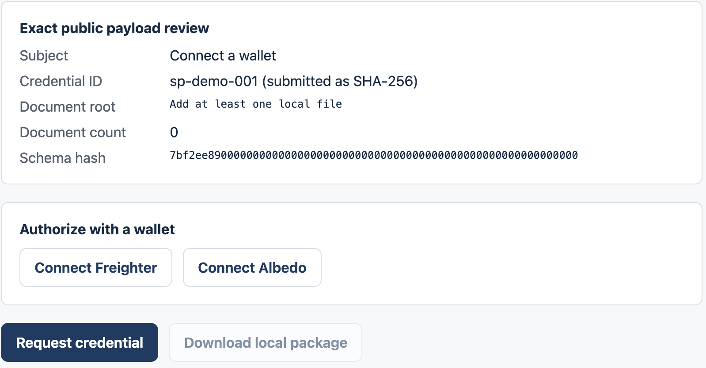
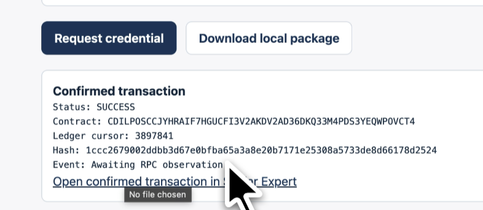
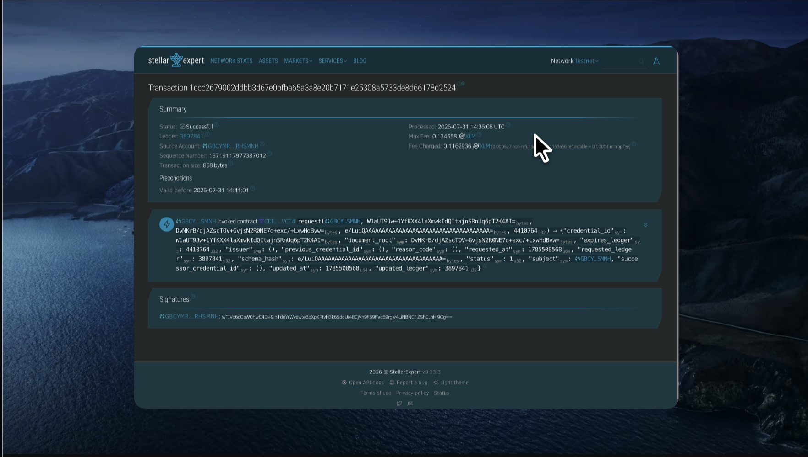
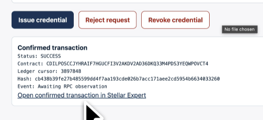
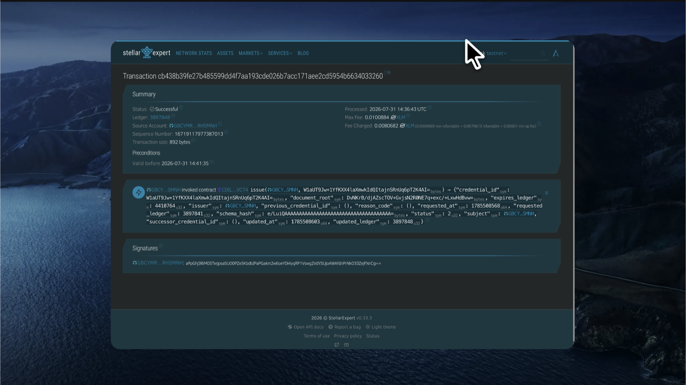
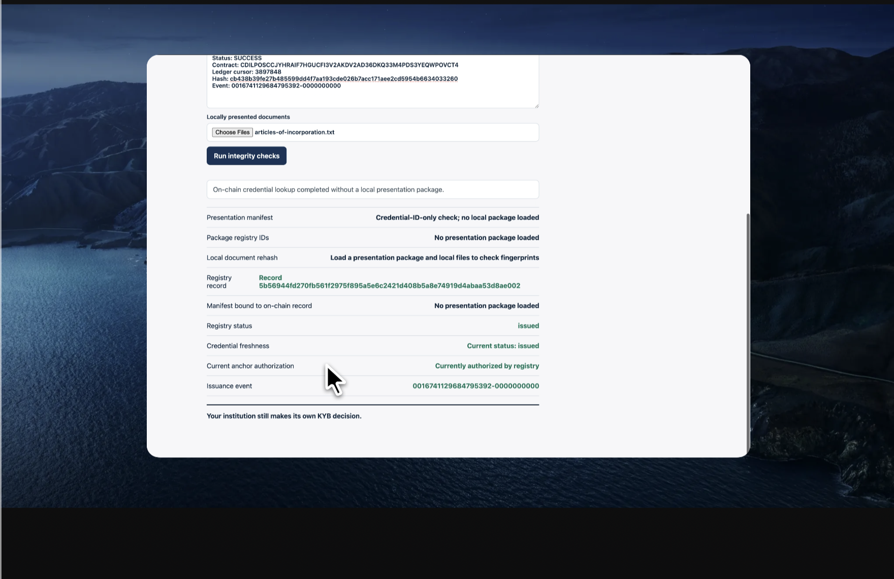
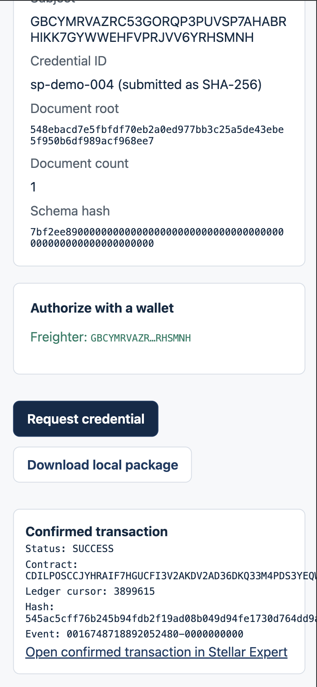
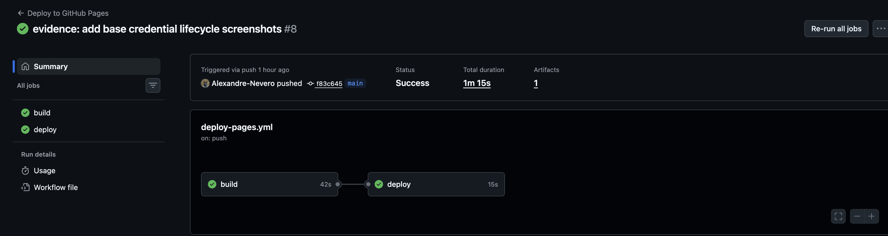

# SelyoPass

**Founder:** Alexandre Nevero

SelyoPass is a testnet prototype for carrying portable Philippine KYB evidence between a startup, a simulated anchor, and a relying institution. It is a **secure data courier, not a compliance stamp**: it can prove record integrity and provenance, but every institution still makes its own KYB decision.

**Live demo (Stellar Testnet):** https://alexandre-nevero.github.io/SelyoPass/

**Demo video:** https://drive.google.com/file/d/1E-6p6m0sYnhyf09cpLWFyUCjkKKy5HMU/view?usp=sharing

## Deployed contracts (Stellar Testnet)

| Contract | Address |
|---|---|
| Anchor Registry | `CBBYFSYQEREJGQQOUF2CIKSFU6T55FTQP3BLHZIGAZI5QD2TFGFVHO2V` |
| Credential Registry | `CDILPOSCCJYHRAIF7HGUCFI3V2AKDV2AD36DKQ33M4PDS3YEQWPOVCT4` |

Full deployment record (WASM hashes, deploy transaction hashes): [deployments/testnet.json](./deployments/testnet.json)

**Example transaction hash (credential request, independently confirmed via [Stellar Expert](https://stellar.expert/explorer/testnet/tx/1ccc2679002ddbb3d67e0bfba65a3a8e20b7171e25308a5733de8d66178d2524)):**
`1ccc2679002ddbb3d67e0bfba65a3a8e20b7171e25308a5733de8d66178d2524`

## Current status

This branch contains the recovery implementation plus immutable credential freshness for the June 30 Stellar Level 3 + APAC submission:

- two Soroban contracts on protocol 27: Anchor Registry and Credential Registry;
- startup-authorized requests and registry-authorized issue/reject/revoke actions;
- immutable credential refresh and supersession: a subject can request a refresh against an existing credential, the anchor issues a successor, and the predecessor is atomically marked superseded and linked to its successor;
- real cross-contract anchor authorization and typed contract events, including refresh-specific events;
- generated TypeScript bindings checked against optimized release WASMs;
- Freighter and Albedo through Stellar Wallets Kit 2.5.0;
- local document hashing, hash-only public payloads, and wallet-free verification that follows successor links with cycle detection;
- explicit transaction and evidence states;
- Vitest, Rust, release-WASM, Playwright, accessibility, documentation, and manifest checks.

A protected testnet release has run. [deployments/testnet.json](./deployments/testnet.json) records real contract IDs, WASM hashes, and transaction hashes for both contracts, and separate wallet-signed requests (Freighter) and issuances (Albedo) have been executed against the live deployment above — see screenshots below.

This is an **experimental, testnet-only** feature: no mainnet deployment, real anchor, or Level 4 approval is claimed. The simulated anchor has no secret in this repository or browser bundle.

## Screenshots

**1. Wallet picker (Freighter and Albedo)**


**2. Credential request — confirmed transaction receipt**


**3. Same request transaction, independently confirmed on Stellar Expert**


**4. Credential issuance — confirmed transaction receipt**


**5. Same issuance transaction, independently confirmed on Stellar Expert**


**6. Wallet-free credential lookup on `#/verify`**


**7. Mobile-responsive UI (390px width) — connected wallet and confirmed transaction**


**8. CI/CD pipeline running and passing**


Test suite: 9 Vitest files / 46+ tests, Rust unit tests, Playwright end-to-end and accessibility checks, all run in the `CI` GitHub Actions workflow on every push to `main` — [latest green run](https://github.com/Alexandre-Nevero/SelyoPass/actions/runs/30641388858).

## Product routes

- `#/prepare` — hash synthetic files locally, review the public payload, connect Freighter or Albedo, and request a new credential or a refresh of an existing one.
- `#/anchor` — explicitly labelled simulated-anchor console for authorized testnet issue/reject/revoke actions, covering both base and refresh requests.
- `#/verify` — wallet-free local and on-chain integrity checks, including superseded-credential and successor-link verification.

The root screen routes people to preparation or verification. GitHub Pages uses hash routes so refreshes do not require a server rewrite.

## Architecture

The browser SPA has no SelyoPass backend or database.

1. The startup hashes synthetic documents locally.
2. Credential Registry stores only the subject address, credential ID hash, document root, schema hash, status, issuer, reason code, previous/successor credential IDs, and ledger metadata.
3. Issue/reject/revoke requires issuer authorization; issuance calls Anchor Registry to prove the issuer is currently authorized.
4. A refresh request links a new credential to an existing one; on issuance, the predecessor is atomically marked superseded and linked forward to its successor.
5. The relying party re-hashes presented files and checks registry record, issuer authorization, lifecycle status, successor linkage, and issuance-event evidence independently.

Document bytes, organization names, registration numbers, and beneficial-owner data must never go on-chain. Testnet fixtures must remain synthetic.

## Prerequisites

- Node.js 22.23.0
- npm
- Rust 1.96.0 with `rustfmt`, `clippy`, and `wasm32v1-none`
- Stellar CLI 27.0.0 for binding and contract-release work
- Freighter or Albedo on Stellar Testnet for authorized browser actions

## Run and verify

```bash
npm ci
npm run dev
```

```bash
npm run lint
npm run typecheck
npm run test:run
npm run build
npm run test:e2e
npm run test:manifests
```

```bash
cargo fmt --manifest-path contracts/Cargo.toml --all -- --check
cargo test --manifest-path contracts/Cargo.toml --workspace
cargo clippy --manifest-path contracts/Cargo.toml --workspace --all-targets -- -D warnings
cargo build --manifest-path contracts/Cargo.toml --workspace --release --target wasm32v1-none
STELLAR_CLI=stellar npm run check:bindings
```

`contracts/deploy.sh` deploys Anchor Registry first, then Credential Registry, registers the simulated issuer, and exercises one synthetic lifecycle. It reads a named identity from the Stellar CLI key store; it never reads or prints the secret. Do not run it against mainnet.

## Documentation

- [Product and engineering document index](./docs/index.md)
- [Product design authority](./DESIGN.md)
- [PRD](./docs/prd.md)
- [Technical design](./docs/technical-design.md)
- [QA test plan](./docs/qa-test-plan.md)
- [Security and compliance](./docs/security-compliance.md)
- [Build and release guide](./docs/BUILD.md)
- [Operations runbook](./docs/ops.md)
- [Submission draft](./submission/evidence.json)

The organizer rubric, institution acceptance, willingness to pay, and pain generalization beyond the original interview remain unvalidated. Level 4-specific development is blocked until written Stellar Builder Team approval is recorded.

## License

See [LICENSE](./LICENSE).
