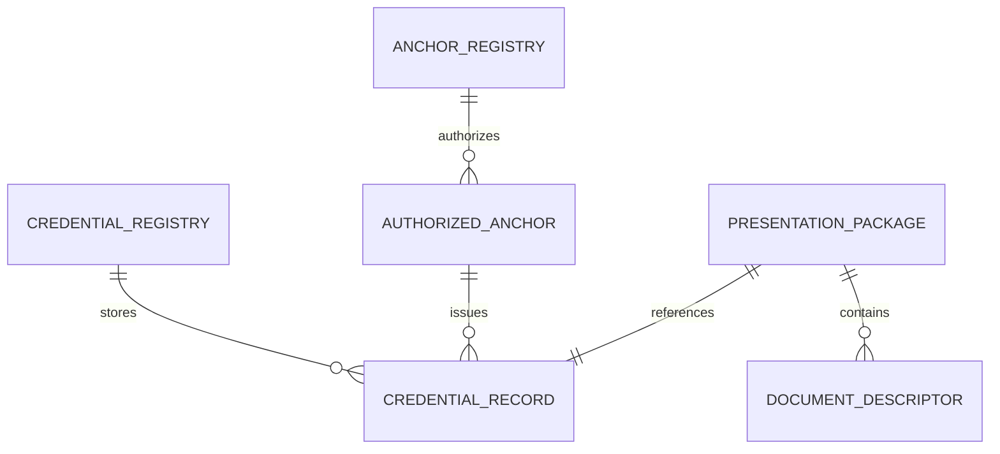

# Data Model — SelyoPass

## 1. Entity Relationships

On-chain records and events contain public hashes, addresses, status, and bounded ledger/reason
codes. Presentation packages and document descriptors remain local to the holder/reviewer.

## 2. Entities & Fields

### AnchorRegistryConfig — on-chain instance storage

| Field | Type | Required | Constraint |
|---|---|---|---|
| `admin` | `Address` | yes | constructor-set; mutations authenticate the stored address |

### AuthorizedAnchor — on-chain persistent storage

| Field | Type | Required | Constraint |
|---|---|---|---|
| `anchor` | `Address` | yes | storage key; unique |
| `authorized` | `bool` | yes | presence/true means authorized |

### CredentialRecord — on-chain persistent storage

| Field | Type | Required | Constraint |
|---|---|---|---|
| `credential_id` | `BytesN<32>` | yes | unique key; derived identifier |
| `subject` | `Address` | yes | authorized request signer |
| `document_root` | `BytesN<32>` | yes | SHA-256 canonical manifest root |
| `schema_hash` | `BytesN<32>` | yes | SHA-256 of schema identifier/version |
| `status` | `CredentialStatus` | yes | `Requested`, `Issued`, `Rejected`, `Revoked` |
| `requested_ledger` | `u32` | yes | ledger at creation |
| `requested_at` | `u64` | yes | ledger timestamp at creation |
| `expires_ledger` | `u32` | yes | greater than request ledger |
| `issuer` | `Option<Address>` | no | set on issue/reject; immutable afterward |
| `reason_code` | `Option<u32>` | no | numeric reject/revoke code; never free text |
| `updated_at` | `u64` | yes | timestamp of latest mutation |
| `updated_ledger` | `u32` | yes | ledger of latest mutation |

`Expired` is a derived read status when current ledger exceeds `expires_ledger`; it is not a
mutation that depends on a keeper transaction.

### CredentialEvent — public RPC event

| Field | Type | Constraint |
|---|---|---|
| `event_id` | RPC event ID | dedupe key; not contract storage |
| `event_kind` | typed symbol | requested/issued/rejected/revoked |
| `credential_id` | `BytesN<32>` | topic |
| `subject` | `Address` | public |
| `issuer` | optional `Address` | issue/reject/revoke only |
| `status` | status code | public |
| `reason_code` | optional `u32` | bounded; no free text |
| `ledger` / `tx_hash` | RPC metadata | receipt/provenance |

### PresentationPackage — off-chain local JSON

| Field | Type | Required | Constraint |
|---|---|---|---|
| `package_version` | string | yes | supported version |
| `network` | string | yes | exactly Stellar testnet for this phase |
| `credential_registry_id` | contract ID | yes | valid contract address |
| `anchor_registry_id` | contract ID | yes | valid contract address |
| `credential_id` | 32-byte hex | yes | matches on-chain key |
| `subject` | public address | yes | matches record |
| `schema_id` / `schema_hash` | string / hash | yes | PH synthetic schema |
| `document_manifest` | descriptor array | yes | no bytes or natural-person fields |
| `document_root` | hash | yes | recomputable |
| `request_tx_hash` | hash | yes | receipt |
| `issue_tx_hash` | optional hash | no | present after issued package refresh |
| `created_at` | ISO timestamp | yes | local metadata; not authority |

### DocumentDescriptor — off-chain local JSON

| Field | Type | Required | Constraint |
|---|---|---|---|
| `document_type` | enum string | yes | SEC/BIR/permit/incorporation/GIS/UBO descriptor |
| `sha256` | 32-byte hex | yes | hash of local bytes |
| `byte_length` | integer | yes | bounded by client limit |
| `display_name` | optional string | no | synthetic/local only; omitted from public payload |

## 3. Constraints & Indexes

- Credential ID and anchor address are fine-grained persistent keys; no global unbounded map.
- Duplicate credential IDs fail.
- Lifecycle transitions follow the graph in `technical-design.md`.
- Only the authenticated original issuer can revoke; current Anchor Registry membership is not
  rechecked, so later anchor removal does not make an issued record unrevocable.
- Reason codes are numeric and never free text; a fixed meaning registry is required before
  external interoperability.
- No package parser accepts embedded document bytes, secret seeds, or unsupported networks.
- Event dedupe uses `event_id`; cursor persistence uses `(network, contract_id)` as its namespace.

## 4. Lifecycle & Migration

Contract schema changes require new release WASM, regenerated bindings, migration analysis, and
testnet redeployment or an explicitly audited upgrade path. The current recovery does not promise
contract upgradeability. On-chain rollback is forward-only: deploy corrected contracts, update a
reviewed deployment manifest, and never rewrite prior chain history. Presentation package versions
must be parsed explicitly; unsupported versions fail closed. Storage TTL is extended on active use,
but archived persistent state and RPC history limitations remain operational risks.

## 5. Data Classification Link

Classification, retention, privacy obligations, and prohibited fields are owned by
[`security-compliance.md`](security-compliance.md).

## 6. Doc Integrity Check

- Every ABI field has a model type.
- No PII/document bytes appear in on-chain entities or events.
- Expiry and TTL are distinct.
- Migration does not imply deletion of chain history.

## References

- [`technical-design.md`](technical-design.md)
- [`security-compliance.md`](security-compliance.md)
