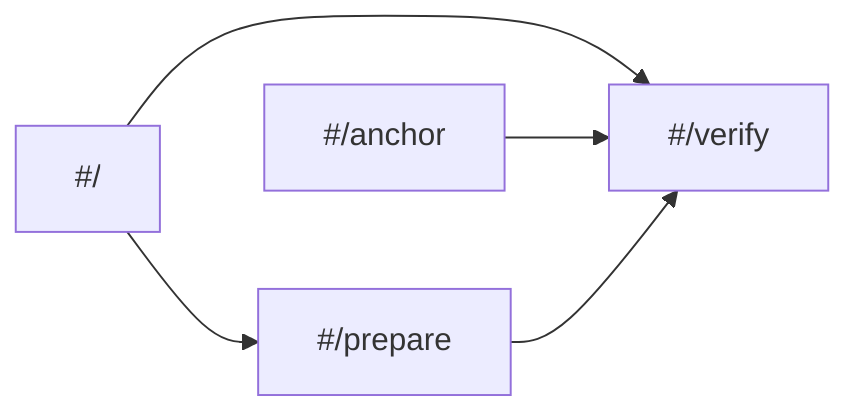

# Design System / UX Spec — SelyoPass

> `DESIGN.md` owns product journeys and the reference lock. This document translates that direction
> into implementable routes, tokens, components, states, and accessibility contracts.

## 1. Design Principles

1. Evidence before reassurance.
2. Trust boundaries appear beside the action or result they qualify.
3. Wallet authorization is requested only when needed.
4. Borders and hierarchy organize ordinary surfaces; overlays alone receive shadow.
5. State is named with icon, label, and text; color is supplementary.
6. Technical detail is accessible but never the only explanation.

## 2. Routes & Actions

| Route | Primary action | Wallet/auth | Public payload |
|---|---|---|---|
| `#/` | Choose “Prepare a credential” or “Check a credential” | none | none |
| `#/prepare` | Review and submit request | Freighter or Albedo only at submit | hashes, subject, ID, schema hash, expiry |
| `#/anchor` | Issue, reject, or revoke | authorized simulated-anchor wallet | lifecycle metadata/events |
| `#/verify` | Check package/ID | none | public reads only |

Unknown hashes return to the role screen with a route message. Hash changes update the screen without
full reload; each route restores focus to its primary heading.

## 3. Component Inventory

| Component | Contract |
|---|---|
| `AppShell` | skip link, header/testnet label, route landmark, no wallet button by default |
| `RoleChoice` | two primary role choices; anchor console as low-emphasis operator link |
| `TrustBoundary` | local/public two-column or stacked disclosure, always text-labelled |
| `StepList` | ordered current/completed/upcoming steps; linear on mobile |
| `Field` / `FilePicker` | visible label, hint, error ID association, 44px control |
| `PublicPayloadReview` | human-readable rows plus expandable canonical payload |
| `WalletPicker` | exactly Freighter and Albedo; install/unavailable states |
| `TransactionReceipt` | persistent state, hash, contract, event, ledger, Explorer link |
| `EvidenceRail` | desktop 280–340px; becomes in-flow sections under tablet breakpoint |
| `EvidenceRow` | icon + label + result + provenance; never status-color alone |
| `StatusNotice` | neutral/success/warning/error semantic surface; no approval claim |
| `TechnicalDisclosure` | native disclosure where possible; copy actions have accessible names |
| `SimulatedAnchorBanner` | non-dismissible truth label at operator entry/action |
| `StickyAction` | mobile-only when it does not obscure errors, links, or content |

## 4. Tokens

### Color

| Token | Value | Role |
|---|---|---|
| `--canvas` | `#F6F8FA` | page background |
| `--surface` | `#FFFFFF` | evidence/work surfaces |
| `--ink` | `#102A43` | headings and primary text |
| `--text-secondary` | `#52606D` | supporting copy |
| `--border` | `#D7DEE7` | ordinary separation |
| `--action` | `#173B63` | primary action only |
| `--action-hover` | `#0E2B49` | primary hover |
| `--accent-amber` | `#F2B134` | progress/focus detail; never body text |
| `--success-text` / `--success-bg` | `#116B45` / `#E8F5EF` | integrity check passed, not business approval |
| `--warning-text` / `--warning-bg` | `#8A5A00` / `#FFF6D8` | attention/pending |
| `--error-text` / `--error-bg` | `#B42318` / `#FDECEC` | failure |
| `--focus` | `#173B63` with white offset | 3px visible focus ring |

Automated contrast checks must validate every actual foreground/background pair. Amber is never used
as text on a light background.

### Type

- UI: `system-ui, -apple-system, BlinkMacSystemFont, "Segoe UI", sans-serif`.
- Technical values: `ui-monospace, SFMono-Regular, Menlo, monospace`.
- Sizes: 13, 16, 19, 23, 28, 33px maximum set; body is 16px/1.55.
- Weights: 400, 500, 600 only.
- Body measure: 65ch; technical identifiers use tabular numerals and safe wrapping.
- Labels use sentence case. Loading text uses the ellipsis character `…`.

### Space, shape, elevation, motion

- Four-pixel base: 4, 8, 12, 16, 24, 32, 48, 64.
- Default radius 8px; pills only for compact categorical labels.
- One-pixel borders on ordinary surfaces; no shadow. Overlays use one restrained shadow.
- Minimum interactive target 44×44px.
- Focus ring 3px plus offset.
- Motion 120–180ms for state continuity; no decorative looping motion.
- `prefers-reduced-motion: reduce` removes nonessential transition/scroll animation.

### Icons

Use one consistent outline family. Icons reinforce adjacent text, inherit semantic color, and use a
24×24 box for ordinary controls. Icon-only buttons require an accessible name and tooltip for
unfamiliar actions. Logos are not taken from the outline icon library.

## 5. Visual States

| Concern | Required states |
|---|---|
| Form/file preparation | empty, editing, hashing, hash error, ready |
| Wallet | disconnected, picker, connecting, connected, unavailable, rejected, wrong network |
| Transaction | idle, simulating, awaiting signature, submitting, pending, success, failed |
| Anchor list | unauthorized, empty, polling, stale cursor, populated, RPC error |
| Credential | requested, issued/active, rejected, expired, revoked, missing |
| Integrity row | checking, pass, fail, unavailable |
| Package | empty, parsing, valid, unsupported version, malformed, network mismatch |

Pending and failed transaction states retain any known hash and Explorer link. Empty states explain
the next valid action. No state uses a vague indefinite spinner.

## 6. UI Voice & Banned Copy

Copy is literal, concise, and action-led. Buttons use verbs: “Review public payload,” “Submit
request,” “Issue credential,” “Check integrity,” “Download package.”

| Do use | Never use |
|---|---|
| Credential integrity result | Verified business |
| Authorized issuer | Trusted/approved company |
| Active on Stellar testnet | Compliant / regulator-approved |
| Simulated Anchor Console | Bank-certified anchor |
| Near-real-time event updates | Live streaming |
| Your institution still makes its own KYB decision | Any distant-only disclaimer |

Every error answers: what happened, whether a transaction was submitted, and what the user can do.
No error includes document content, PII, secret material, or raw XDR by default.

## 7. Accessibility

- WCAG 2.2 AA target with axe plus manual review.
- Semantic landmarks, one page `h1`, ordered headings, skip link, and route-focus management.
- Full keyboard completion; visible focus on every interactive element; Escape closes overlays.
- Errors are associated through `aria-describedby`; transaction/status changes use polite live
  regions and do not repeatedly announce unchanged polling.
- Dialogs trap and restore focus; disclosures are operable with native keyboard behavior.
- Status is never color-only; icons used as status have accompanying visible text.
- Viewport zoom and reflow work at 390×844, 768×1024, and 1440×900 without horizontal page overflow.

## 8. Provenance & Overrides

Primary authority is the reference lock in [`DESIGN.md`](../DESIGN.md). Local Refero Design 1.1
craft references informed type, color, motion, icons, copy, accessibility, and anti-slop rules.
Dock contributes role/integrity clarity; Persona contributes staged lifecycle; wallet transaction
UX contributes persistent receipts. No paid Refero MCP material, stock media, or generated imagery
is used. Any override requires a dated decision-ledger entry and a `DESIGN.md` update.

## 9. Key Screen Specs

### Prepare

Desktop: workflow left, evidence rail right. Privacy boundary precedes fields; public-payload review
precedes wallet picker. Receipt replaces the action area but does not remove reviewed payload.

### Simulated Anchor Console

The simulation banner and connected address precede pending requests. A request row shows credential
ID, subject, roots, request ledger/event, and lifecycle actions. Issuance displays the cross-contract
authorization result.

### Verify

Package/ID input precedes metadata preview. Five independent evidence rows precede the neutral result
heading and adjacent KYB-decision statement. Technical details are expandable; status and Explorer
links remain visible.

## 10. Doc Integrity Check

- Routes and auth expectations match the PRD and technical design.
- Tokens preserve the approved role meanings.
- Every named state has a QA case.
- Banned copy enforces `INV-001` and `INV-006`.

## References

- [`DESIGN.md`](../DESIGN.md)
- [`prd.md`](prd.md)
- [`qa-test-plan.md`](qa-test-plan.md)
- [`security-compliance.md`](security-compliance.md)
