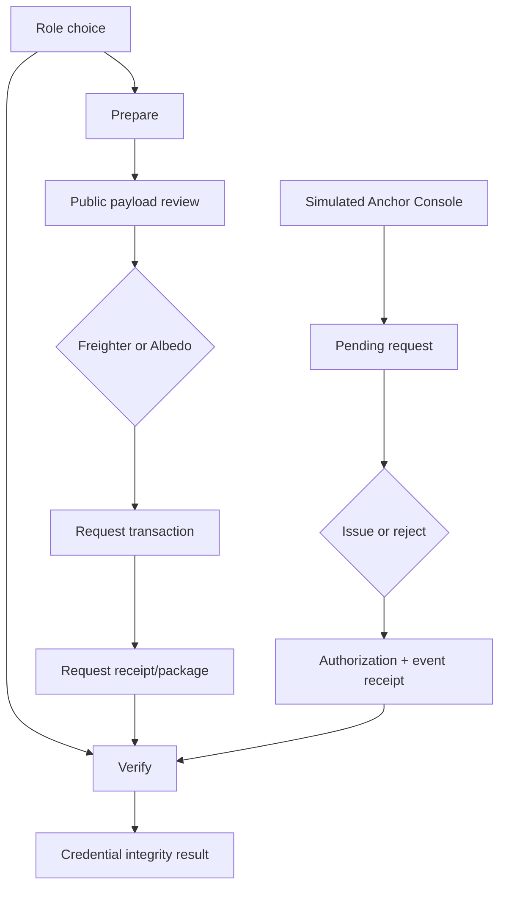

# PRD — SelyoPass

`idea.md` is the immutable schema-3 input brief: it records the feature set and priorities that
seeded generation and remains the provenance/traceability origin. Under the local FMD 6.0.1
manifest and templates, this PRD is the sole post-generation owner of current feature definitions,
MoSCoW priorities, personas, stories and Given/When/Then acceptance criteria, cross-cutting rules,
and flows. Preserve `F-###` identity—never renumber or reuse it—but reconcile current product changes
here and log material departures from the seed in the Decision Ledger. The seed table is not a
competing current authority.

## 1. Product Purpose & Value Proposition

SelyoPass lets a Philippine startup prepare a hash-only credential request, lets an authorized
simulated anchor issue it on Stellar testnet, and lets a relying party inspect integrity evidence
without a wallet. It aims to reduce duplicated document collection while leaving every compliance
decision with the relying institution. Success targets live in [`idea.md` §8](../idea.md).

## 2. Personas

| Persona | Role & context | Frequency | Today's workaround | Stories |
|---|---|---|---|---|
| Founder / startup subject | Prepares synthetic KYB evidence during financial integrations | Several times in an early integration window | Re-submit PDFs and forms to each partner | US-001, US-002, US-003 |
| Simulated anchor operator | Demonstrates authorized review and lifecycle action on testnet | Demo/operator use | Browser-held test secret or manual CLI, both rejected | US-004, US-005 |
| Relying-party reviewer | Checks a presented package while retaining institutional judgment | Each onboarding/review | Re-collect and manually compare documents | US-006, US-007 |
| Release reviewer | Audits whether submission claims match a release | Each candidate release | Screenshots and claims gathered manually | US-008 |

## 3. Feature Set & Priority

The initial rows trace to [`idea.md` §7](../idea.md). Definitions and priorities below are current;
change them here, preserve stable IDs, and record a material seed departure in the Decision Ledger.

| `F-###` | Feature | Priority | Solves | Notes / why not |
|---|---|---|---|---|
| F-001 | Philippine KYB presentation schema | Must | Shared package structure | Synthetic descriptors only |
| F-002 | Subject-requested, anchor-issued Soroban lifecycle | Must | Inspectable credential provenance | Testnet |
| F-003 | Local hashing and hash-only anchoring | Must | Integrity without custody | SHA-256 |
| F-004 | Wallet-free integrity reader | Must | Independent consumption | Neutral result language |
| F-005 | Responsive role workflows | Must | Mobile/tablet/desktop use | Three required viewports |
| F-006 | Explicit operation and lifecycle states | Must | Failure ambiguity | Includes rejected/expired/revoked |
| F-007 | Target multi-wallet support through Wallets Kit | Must | Wallet choice | Target adapters are Freighter and Albedo; both require real connection evidence |
| F-008 | Transaction lifecycle and RPC event synchronization | Must | Observable progress and provenance | Five-second polling, not streaming |
| F-101 | Continuous re-verification | Won't | Credential freshness | Requires written Level 4 approval |
| F-102 | Cross-jurisdiction schemas | Won't | SEA reuse | Philippines-only |
| F-103 | Anchor Registry + Credential Registry cross-contract design | Must | Meaningful authorization | Two contracts, not artificial layers |
| F-104 | Real-anchor onboarding | Won't | Institutional network bootstrap | No partner agreement or approval |

## 4. User Stories & Acceptance Criteria

**US-001 — Prepare a public request** *(F-001, F-003)*
As a founder, I want to hash synthetic documents locally and inspect the exact public payload.

- Given selected local files, when hashing completes, then document bytes remain in the browser and
  the review shows only a document root, schema hash, credential ID, subject, and expiry.
- Given the review screen, when the founder changes an input, then the public-payload preview and
  derived hashes update before submission.

**US-002 — Choose and authorize a wallet** *(F-002, F-007)*
As a founder, I want Freighter or Albedo at the point of request authorization.

- Given a supported wallet, when selected, then Wallets Kit connects it on testnet and shows the
  selected public address and network.
- Given an unavailable wallet, wrong network, rejected signature, or unfunded account, when the
  request is attempted, then the UI names the failure, confirms whether submission occurred, and
  offers a safe recovery.

**US-003 — Submit and retain request evidence** *(F-002, F-006, F-008)*
As a founder, I want a durable transaction receipt and local presentation package.

- Given a valid reviewed payload, when authorized, then Credential Registry `request` is invoked and
  the UI progresses through the defined transaction states.
- Given confirmation, when the receipt renders, then it includes transaction hash, contract ID,
  request event, ledger cursor, Explorer link, and package download.

**US-004 — Review pending requests** *(F-001, F-005, F-008)*
As a simulated anchor operator, I want to inspect pending hash-only request metadata.

- Given `#/anchor`, when no authorized wallet is connected, then the page clearly identifies the
  simulated operator surface and does not expose a secret-entry path.
- Given observed request events, when the list updates, then duplicates are removed and document
  bytes, names, and free text are absent.

**US-005 — Issue or reject through authorization** *(F-002, F-006, F-103)*
As a simulated anchor operator, I want issuance to prove anchor authorization.

- Given an authorized issuer, when issuing, then Credential Registry calls Anchor Registry
  `is_authorized`, records the issued state, and emits the issuance event.
- Given an unauthorized issuer or illegal transition, when issuing/rejecting/revoking, then the
  contract returns a typed error and the UI preserves the failed receipt.

**US-006 — Inspect credential integrity** *(F-003, F-004)*
As a relying-party reviewer, I want independent evidence rows without connecting a wallet.

- Given a package or credential ID, when verification runs, then the page shows identity metadata
  before the result and checks existence, issuer authorization, hash match, active status, and
  issuance event/transaction separately.
- Given local documents, when re-hashed, then mismatches identify the affected manifest entry without
  uploading its bytes.

**US-007 — Understand the result boundary** *(F-004, F-005, F-006)*
As a relying-party reviewer, I want integrity distinguished from compliance judgment.

- Given any result, when it renders, then the heading is “Credential integrity result” and
  “Your institution still makes its own KYB decision” appears beside it.
- Given rejected, expired, revoked, missing, RPC-failed, or mismatched evidence, when displayed,
  then status is communicated by icon, label, and text rather than color alone.

**US-008 — Audit a release** *(F-005, F-006, F-007, F-008, F-103)*
As a release reviewer, I want one manifest bound to a release SHA.

- Given a release candidate, when the pre-submission checker runs, then it fails on missing, stale,
  contradictory, unreachable, or cross-SHA evidence.
- Given a candidate that passes, when reviewed, then test, deployment, interaction, event,
  inter-contract, wallet, responsive, CI, Pages, and demo evidence resolve to that SHA.

### 4.1 Cross-cutting rules (`BR-###`)

| `BR-###` | Rule | Invoked by |
|---|---|---|
| BR-001 | Issue/reject require issuer auth plus current Anchor Registry membership; revoke requires auth by the original issuer and remains available after later anchor removal; reads are public. | US-003, US-005, US-006 |
| BR-002 | Real PII is prohibited; identity-shaped values are explicitly synthetic and local only; public/on-chain/log payloads contain hashes and bounded non-identity metadata only. | US-001, US-004, US-006 |
| BR-003 | Integrity language never claims compliance approval. | US-006, US-007, US-008 |
| BR-004 | Transaction receipts persist terminal evidence and Explorer links. | US-003, US-005, US-008 |
| BR-005 | Wallet-dependent actions support both Freighter and Albedo on testnet. | US-002, US-005, US-008 |
| BR-006 | All fixtures and demonstrations use synthetic data. | US-001, US-004, US-008 |
| BR-007 | Event synchronization polls RPC every five seconds, deduplicates by event ID, persists the last processed ledger, backs off on errors, and stops on unmount. | US-003, US-004, US-008 |
| BR-008 | Evidence claims are release-SHA-bound and remain unproven until directly observed. | US-003, US-008 |

## 5. App Flow & UX Intent

Visual authority: [`DESIGN.md`](../DESIGN.md); component authority:
[`design-system.md`](design-system.md).

### 5.1 Screen Inventory

| Screen | Purpose | Entry points | States |
|---|---|---|---|
| Role choice | Choose prepare or verify | root | default, route error |
| Prepare | Local hash, payload review, request, receipt | `#/prepare` | empty, editing, hashing, wallet, transaction, success, error |
| Simulated Anchor Console | Review and act on pending requests | `#/anchor` | disconnected, unauthorized, empty, polling, issuing, rejecting, error |
| Verify | Inspect package and integrity evidence | `#/verify` | empty, parsing, checking, active, mismatch, missing, rejected, expired, revoked, RPC error |

### 5.2 App Flow

There are no intentional dead ends: wallet and RPC failures return to the last reviewed state;
verification remains available without a wallet; local packages can be resumed after download.

### 5.3 Onboarding Flow

First value is seeing the exact split between local document bytes and public hashes before any
wallet prompt. There is no account creation. The user chooses a role and may leave without signing.

### 5.4 UX Constraints

- Privacy boundary and testnet/simulated-anchor label stay visible at the relevant action.
- Technical identifiers use copy controls and remain available in terminal states.
- Every asynchronous step has a named state; no indefinite generic spinner.
- Layout and interaction contracts are owned by `design-system.md`.

### 5.5 Instrumentation & Event Taxonomy

No third-party analytics is approved. Contract events and local test telemetry are the only planned
signals; neither may include PII.

| Event | Fires when | Properties | Feeds |
|---|---|---|---|
| `request_confirmed` | request transaction is confirmed | credential_id_hash, tx_hash, ledger | activation |
| `credential_issued` | issued event is observed | credential_id_hash, issuer, tx_hash, ledger | lifecycle proof |
| `integrity_checked` | all evidence rows resolve | result_codes, ledger | integrity proof |

## 6. Non-Goals

The full boundary is in [`idea.md` §10](../idea.md). This release also does not promise institutional
acceptance, production uptime, or mainnet readiness.

## 7. Dependencies & Open Questions

**Dependencies:** current Stellar SDK/RPC behavior, Stellar Wallets Kit, Freighter, Albedo, two
deployed testnet contracts, GitHub Actions/Pages, and a published current competition rubric.

**Open questions:**

- Which official rubric and deadline apply to this release? — human release owner must supply them.
- Which testnet accounts are the admin and simulated anchor? — deployment workflow resolves without
  committing secrets.
- Will any institution accept preferred intake? — direct compliance-owner interview resolves.
- Will written Level 4 approval be granted? — Stellar Builder Team response resolves.

## 8. Doc Integrity Check

- Every current `F-###` traces to the immutable seed or a later logged decision; no ID was renumbered
  or reused.
- Every Must feature maps to at least one story and QA case.
- Every story has observable Given/When/Then criteria.
- Routes/tokens are linked, not owned here.
- Hard rules are referenced through the security document.

## References

- [`idea.md`](../idea.md)
- [`DESIGN.md`](../DESIGN.md)
- [`design-system.md`](design-system.md)
- [`system-design.md`](system-design.md)
- [`qa-test-plan.md`](qa-test-plan.md)
- [`security-compliance.md`](security-compliance.md)
