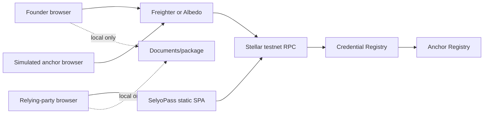
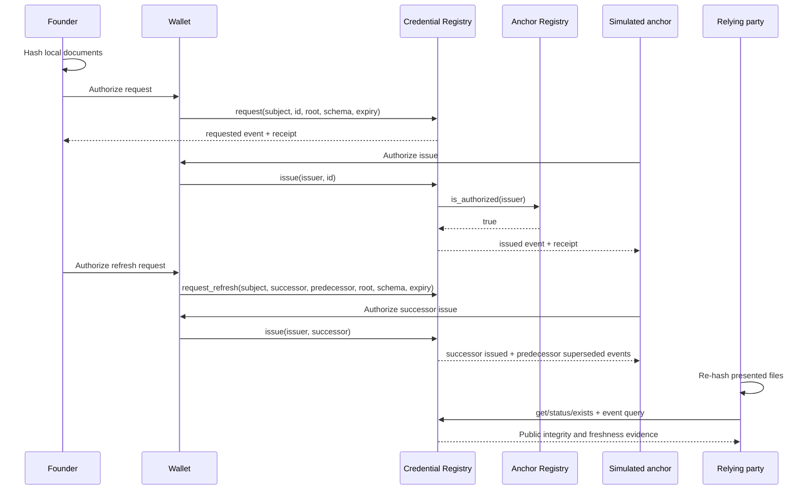

# System Design — SelyoPass

> Target architecture. The current repository, tests, testnet deployment manifest, and browser
> observations—not this document—prove implementation status.

## 1. System Context

SelyoPass is a backend-less React/Vite SPA. It never receives document bytes on a server because
there is no SelyoPass server. Wallets sign account authorization; RPC simulates, submits, reads
contract state, and returns events. GitHub Pages hosts static assets.

## 2. Components & Responsibilities

| Component | Responsibility | Explicit non-responsibility |
|---|---|---|
| Prepare UI | Synthetic form, local SHA-256 hashing, payload preview, request receipt/package | Document upload, anchor signing |
| Anchor Console | Pending-event view and authorized issue/reject/revoke actions | Secret custody, real compliance review |
| Verify UI | Local package parse/re-hash and public evidence rows | Compliance decision |
| Wallet adapter | Wallets Kit selection, Freighter/Albedo connection/signing, testnet check | Private-key access |
| Credential client | Generated binding calls, simulation, submission, transaction polling | Classic `manageData` |
| Event synchronizer | Five-second RPC `getEvents` polling, event-ID dedupe, ledger cursor, backoff, cleanup | WebSocket/streaming claim, long-term indexing |
| Anchor Registry | Admin-managed authorized-anchor set | Credential records |
| Credential Registry | Request/lifecycle state, typed events, cross-contract issuer check | Document bytes, names, free text |
| Local presentation package | Portable synthetic metadata, manifest, hashes, chain references | A compliance stamp |

## 3. Data Flow

All transaction writes are atomic. If the Anchor Registry call or authorization fails, issuance
state and event emission roll back.

## 4. Technology Choices & Trade-offs

| Choice | Target pin | Why | Trade-off |
|---|---|---|---|
| React 18 + Vite 5 | existing application family | Static, browser-only deployment | Client owns all orchestration |
| `@stellar/stellar-sdk` | 16.1.0 | Contract client, RPC, XDR | Upgrade requires binding/API verification |
| Stellar Wallets Kit | 2.5.0 | Target Freighter + Albedo picker | External wallet behavior remains unproven until real connection tests |
| `soroban-sdk` | 27.0.3 | Typed contracts/events/auth | Must match live testnet protocol |
| Stellar CLI | 27.0.0 | Build, bindings, deploy, invoke | Runner pin and cache cost |
| RPC polling | 5 seconds | RPC has no WebSocket event stream | Near-real-time only; recent-history window |
| Hash routing | native `location.hash` | GitHub Pages direct links | Less routing machinery |
| GitHub Pages | canonical static deployment | One release surface | No server-side storage/indexing |

Pins are target requirements from the approved recovery plan and must be revalidated against the
live testnet protocol and official package releases before installation/deployment.

## 5. Integration Points and Failure Behaviour

| Integration | Auth | Failure behavior |
|---|---|---|
| Wallets Kit / Freighter / Albedo | wallet-controlled account | unavailable, denied, disconnected, or wrong-network states return to reviewed payload |
| Stellar RPC | public read; signed tx for mutation | timeout/backoff; transaction receipt distinguishes not submitted, pending, failed, success |
| Anchor Registry | admin auth for mutations; public `is_authorized` | typed error or false; issuance rolls back |
| Credential Registry | subject auth for request; issuer auth for lifecycle; public reads | typed contract errors map to stable UI messages |
| GitHub Pages | public static assets | post-deploy HTTP and browser smoke gate |

## 6. Deployment Topology

CI builds static assets and optimized release WASMs. A protected manual testnet release deploys
Anchor Registry first, deploys Credential Registry with the first ID, registers the simulated anchor,
records immutable IDs/hashes/transactions in `deployments/testnet.json`, and generates/checks
bindings. GitHub Pages deploys only the release candidate that passed all required gates. There is
no mainnet path in this phase.

## 7. Scaling Strategy & Non-Functional Risk

The demo uses direct RPC reads and recent event polling; it is not a production indexer. RPC event
history is bounded, so a future long-lived product would need an indexer or data pipeline. Contract
records use fine-grained persistent storage and explicit TTL extension; expiry is a stored lifecycle
rule, never inferred from TTL. Browser hashing can exhaust memory on oversized files, so file limits
must be implemented and tested before real use. GitHub Pages and public RPC provide no production
availability commitment.

## 8. Doc Integrity Check

- Two contracts have distinct responsibilities and one meaningful cross-contract call.
- Every exposed surface has an auth posture.
- All data paths preserve the hash-only boundary.
- Planned behavior is not described as deployed.

## References

- [`technical-design.md`](technical-design.md)
- [`data-model.md`](data-model.md)
- [`security-compliance.md`](security-compliance.md)
- [`ops.md`](ops.md)
