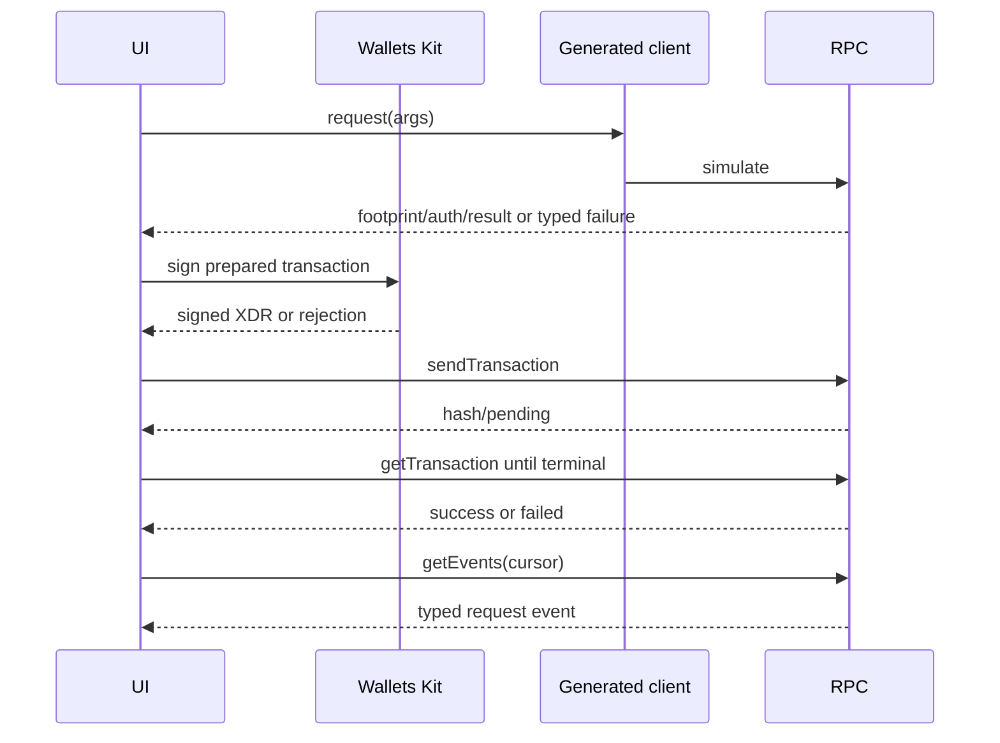

# Technical Design — SelyoPass

## 1. Coverage

This document freezes contract ABIs, frontend module boundaries, transaction state, event polling,
and error mapping. JSX composition, ordinary CSS, and generated binding internals are excluded.

## 2. Contract Interfaces

### Anchor Registry

```text
__constructor(admin: Address)
add_anchor(admin: Address, anchor: Address) -> Result<(), AnchorError>
remove_anchor(admin: Address, anchor: Address) -> Result<(), AnchorError>
is_authorized(anchor: Address) -> bool
```

- Constructor stores the admin in instance storage.
- `add_anchor` and `remove_anchor` load the stored admin and require its authorization; the
  caller-provided address cannot redefine the admin.
- Anchor membership uses persistent fine-grained storage.
- Mutations extend instance and touched-entry TTLs and publish typed `AnchorAdded` /
  `AnchorRemoved` events.
- A supplied address that is not the stored admin returns typed `IncorrectAdmin`; missing
  initialization remains a deployment/configuration failure because construction is atomic.

### Credential Registry

```text
__constructor(anchor_registry: Address)
request(
  subject: Address,
  credential_id: BytesN<32>,
  document_root: BytesN<32>,
  schema_hash: BytesN<32>,
  expires_ledger: u32
) -> Result<CredentialRecord, CredentialError>
request_refresh(
  subject: Address,
  credential_id: BytesN<32>,
  previous_credential_id: BytesN<32>,
  document_root: BytesN<32>,
  schema_hash: BytesN<32>,
  expires_ledger: u32
) -> Result<CredentialRecord, CredentialError>
issue(
  issuer: Address,
  credential_id: BytesN<32>
) -> Result<CredentialRecord, CredentialError>
reject(
  issuer: Address,
  credential_id: BytesN<32>,
  reason_code: u32
) -> Result<CredentialRecord, CredentialError>
revoke(
  issuer: Address,
  credential_id: BytesN<32>,
  reason_code: u32
) -> Result<CredentialRecord, CredentialError>
get(credential_id: BytesN<32>) -> Result<CredentialRecord, CredentialError>
status(credential_id: BytesN<32>) -> Result<CredentialStatus, CredentialError>
exists(credential_id: BytesN<32>) -> bool
```

The names, argument order, and typed return values above match the implemented contract and generated
binding ABI. `BytesN<32>` resolves the plan's hash-shaped identifiers explicitly. Successful writes
return the resulting record; `get` and `status` return typed `NotFound` errors rather than bare
values. Release-WASM-generated bindings remain the drift-check authority.

Lifecycle:

```text
Requested -> Issued -> Revoked
Requested -> Rejected
Issued -> refresh Requested -> successor Issued + predecessor Superseded
Requested or Issued -> Expired (derived when current ledger > expires_ledger)
```

Rules:

- `request` calls `subject.require_auth()`, rejects duplicate IDs, stores
  hashes/addresses/bounded ledger metadata only, extends TTL, and emits `CredentialRequested`.
- `issue`, `reject`, and `revoke` call `issuer.require_auth()`.
- `issue` calls the configured Anchor Registry `is_authorized(issuer)` and rejects false.
- `reject` also requires authorized-anchor membership and only accepts `Requested`.
- `request_refresh` requires subject auth, a distinct successor ID, matching predecessor subject,
  a stored `Issued` predecessor, continuing authorization of its issuer, and no pending successor.
  It never overwrites the predecessor. A derived-expired stored `Issued` predecessor remains
  refreshable.
- Refresh issue/reject require the predecessor issuer as well as current anchor authorization.
  Successful issue atomically links the records, marks the predecessor `Superseded`, clears the
  pending key, and emits `credential_issued` plus `credential_superseded`; rejection only clears
  the pending key and leaves the predecessor unchanged.
- `revoke` requires authorization by the record's original issuer and only accepts `Issued`; it
  intentionally does not recheck Anchor Registry membership, so later anchor removal does not
  prevent revocation of an already-issued record.
- Illegal transitions, missing records, duplicate IDs, invalid expiry, unauthorized anchors, and
  wrong revocation issuer return typed `CredentialError` values.
- Missing reads fail with the typed `NotFound` contract error.
- Typed events are `CredentialRequested`, `CredentialIssued`, `CredentialRejected`, and
  `CredentialRevoked`. Topics carry event kind and credential ID; data carries only the public
  record fields needed by the UI. Reason codes are numeric and never free text.
- Stored expiry, not storage TTL, determines expiry. Active reads extend the relevant persistent TTL
  without changing lifecycle meaning.

## 3. Frontend Module Interfaces

| Module | Public responsibility |
|---|---|
| `routing` | Parse `location.hash`, return `prepare`, `anchor`, `verify`, or root; subscribe/unsubscribe to hash change |
| `wallet` | Initialize Wallets Kit for testnet; expose Freighter/Albedo connect, disconnect, address, network, and sign |
| `hashing` | Stream/read local bytes, SHA-256 each file, canonicalize manifest, derive document root and schema hash |
| `credentialClient` | Construct generated Credential Registry client; simulate and sign/send ABI calls |
| `anchorClient` | Public authorization lookup and admin deployment support outside the browser |
| `transactionMachine` | Pure reducer for `idle`, `simulating`, `awaiting_signature`, `submitting`, `pending`, `success`, `failed` |
| `eventSync` | Poll `getEvents`, dedupe, persist cursor, retry/backoff, abort/cleanup |
| `package` | Validate and serialize the local presentation package without secret/bytes inclusion |
| `verification` | Compose public record, authorization, local hash, status, and event evidence rows |

Generated bindings come from optimized release WASMs. CI regenerates them into a temporary directory
and fails on diff; hand-authored ABI conversion is prohibited.

## 4. Non-Obvious Logic

### Canonical document root

Each selected file becomes `{document_type, sha256, byte_length}`. Entries are sorted by
`document_type` then hash; canonical JSON uses fixed keys and UTF-8; SHA-256 of that canonical byte
sequence is `document_root`. Organization names and document bytes are excluded.

### Transaction reducer

Only these transitions are legal:

```text
idle -> simulating
simulating -> awaiting_signature | failed
awaiting_signature -> submitting | failed
submitting -> pending | failed
pending -> success | failed
success | failed -> simulating
```

The reducer stores a user-safe error message. The transaction hash appears after RPC submission and
is retained in pending and terminal states. The current implementation does not store per-transition
timestamps or expose a separate reset-to-idle action.

### Event synchronization

1. Initialize `startLedger` from the persisted cursor, otherwise latest ledger minus a bounded
   recovery window.
2. Every five seconds call RPC `getEvents` filtered to the Credential Registry.
3. Sort by ledger/event order; ignore event IDs already in the session set.
4. Apply events, then persist the greatest fully processed ledger.
5. On error, preserve the cursor and exponentially back off to a bounded interval.
6. Abort in-flight work and clear timers on unmount or contract/network change.

RPC polling is called **near-real-time synchronization**, never streaming. A cursor beyond RPC's
retention window triggers a visible “history unavailable” state rather than an invented timeline.

## 5. Interaction Sequences



## 6. Error Propagation

| Source | Stable UI class | Required message content |
|---|---|---|
| Wallet missing/denied/disconnected | `wallet_unavailable` / `signature_rejected` | No transaction submitted; install/reconnect/retry |
| Wrong network | `wrong_network` | Expected testnet; switch network |
| Unfunded/insufficient balance | `account_unfunded` | Testnet funding required; no secret requested |
| Simulation/RPC timeout | `rpc_unavailable` | Submission status and retry safety |
| Contract typed error | `contract_rejected` plus code | Action, record status, safe recovery |
| Pending transaction timeout | `transaction_pending` | Hash and Explorer link remain visible |
| Package/hash invalid | `package_invalid` / `hash_mismatch` | Affected field/document descriptor, never bytes |
| Event cursor too old | `event_history_unavailable` | State read still available; event history not asserted |

Unknown errors are logged only as scrubbed codes in development and rendered generically with the
transaction hash when available.

## 7. Component Decisions

- Use `contract.Client`/generated bindings for contract calls, not Classic operations or hand-built
  `ScVal` calls.
- Use RPC for smart-contract submission/state/events; Horizon is not part of the contract path.
- Keep admin and simulated-anchor deployment identities outside browser code.
- Treat wallet signing and contract confirmation as separate observable steps.
- Keep package download local and explicit; no browser persistence of document bytes.

## 8. Doc Integrity Check

- Interfaces match the approved recovery plan and are represented in QA cases.
- Expiry semantics are independent of TTL.
- Cross-contract authorization occurs inside `issue`.
- Polling behavior and cleanup are testable.

## References

- [`system-design.md`](system-design.md)
- [`data-model.md`](data-model.md)
- [`qa-test-plan.md`](qa-test-plan.md)
- Stellar contract, dApp, and RPC skill references pinned in the workspace.
